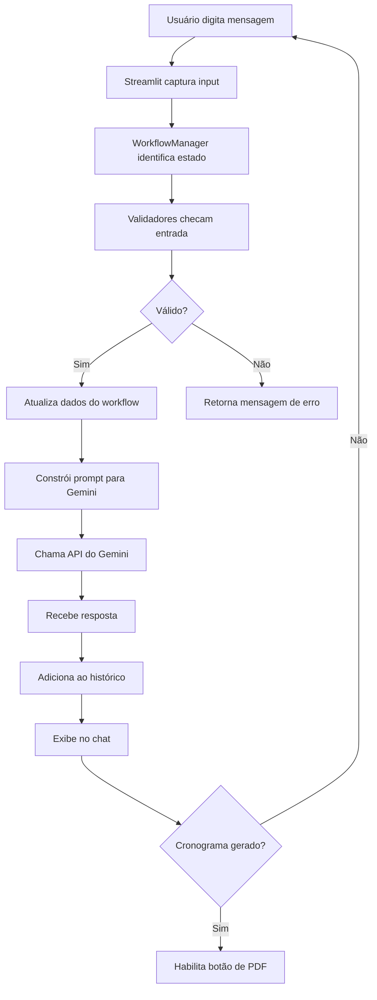

# 📚 Chatbot de Estudos Personalizados - Documentação Completa

## 📋 Sumário
1. [Introdução](#introdução)
2. [Objetivo](#objetivo)
3. [Como Utilizar o App](#como-utilizar-o-app)
4. [Passo a Passo de Criação](#passo-a-passo-de-criação)
5. [Arquitetura e Desenvolvimento](#arquitetura-e-desenvolvimento)
6. [Funcionalidades Detalhadas](#funcionalidades-detalhadas)
7. [Resultados Esperados](#resultados-esperados)

---

## 📖 Introdução

O **Chatbot de Estudos Personalizados** é uma aplicação inteligente que ajuda pessoas a conseguirem um norte para estudar sobre assuntos diversos, fornecendo cronogramas de estudo personalizados baseados em metodologias comprovadas de aprendizagem.

### Por que este chatbot?

Muitas pessoas enfrentam dificuldades ao tentar estruturar seus estudos:
- ❓ "Por onde começar?"
- ⏰ "Quanto tempo dedicar a cada tópico?"
- 📊 "Qual metodologia se encaixa melhor no meu perfil?"
- 🎯 "Como alcançar meus objetivos no prazo disponível?"

Este chatbot utiliza o poder da **Inteligência Artificial (Google Gemini 2.5 Flash)** para criar planos de estudo totalmente personalizados, considerando:
- 📚 O tema que você deseja estudar
- 🎓 Seu nível atual de conhecimento
- ⏱️ Tempo disponível diariamente
- 📅 Prazo para alcançar seus objetivos
- 🧠 Metodologia de aprendizagem ideal para seu perfil

---

## 🎯 Objetivo

### Objetivo Principal
Democratizar o acesso a planos de estudo personalizados e profissionais, utilizando metodologias comprovadas de aprendizagem e IA generativa para criar cronogramas sob medida.

### Público-Alvo
- 🎓 **Estudantes** - Vestibulares, concursos, provas escolares
- 💼 **Profissionais** - Upskilling, mudança de carreira, certificações
- 🧑‍💻 **Autodidatas** - Aprendizado contínuo em qualquer área
- 👨‍🏫 **Educadores** - Criação de planos de ensino estruturados
- 🚀 **Empreendedores** - Aprendizado rápido de novas habilidades

### Problema que Resolve
1. **Falta de Estrutura** - Muitos iniciam estudos sem planejamento
2. **Sobrecarga de Informações** - Dificuldade em priorizar o que estudar
3. **Metodologia Inadequada** - Uso de técnicas que não funcionam para o perfil
4. **Falta de Acompanhamento** - Ausência de marcos e revisões
5. **Desistência** - Planos genéricos que não consideram limitações reais

### Diferenciais
✅ Conversação natural e intuitiva  
✅ 6 metodologias de aprendizagem diferentes  
✅ Cronogramas exportáveis em PDF  
✅ Refinamento iterativo do plano  
✅ 100% gratuito e open-source  

---

## 🚀 Como Utilizar o App

### Passo 1: Acessar a Aplicação
```bash
# Opção 1: Acesso Online (Streamlit Cloud)
https://chatbot-estudos.streamlit.app/

# Opção 2: Executar Localmente
streamlit run streamlit_app.py
```

### Passo 2: Iniciar a Conversa
Ao abrir o aplicativo, você verá uma mensagem de boas-vindas do chatbot. Ele irá se apresentar e perguntar **qual tema você gostaria de estudar**.

**Exemplo de resposta:**
```
"Quero estudar Python para Data Science"
"Preciso aprender Inglês para entrevistas"
"Gostaria de estudar Cálculo I para a faculdade"
```

### Passo 3: Escolher a Metodologia
O chatbot apresentará **6 metodologias de aprendizagem**:

| Metodologia | Ideal Para |
|------------|-----------|
| 🌱 **Long-life Learning** | Aprendizado sustentável e contínuo |
| 🧘 **Shoshin** | Iniciantes com mente aberta |
| 📐 **Kumon** | Domínio através da repetição |
| 🍅 **Pomodoro** | Gestão de tempo e foco |
| 🔄 **Spaced Repetition** | Retenção de longo prazo |
| 🧠 **Feynman** | Compreensão profunda |

**Escolha a metodologia** que mais se alinha com seu perfil e objetivos.

### Passo 4: Fornecer Informações Adicionais
O chatbot fará perguntas para personalizar seu cronograma:

📌 **Tempo disponível diariamente**
- Exemplo: "2 horas por dia", "30 minutos", "Finais de semana apenas"

📌 **Prazo para alcançar o objetivo**
- Exemplo: "3 meses", "6 semanas", "1 ano"

📌 **Nível atual de conhecimento**
- Exemplo: "Iniciante", "Intermediário", "Avançado"

### Passo 5: Receber o Cronograma
Baseado nas suas respostas, o chatbot gerará um **cronograma detalhado** com:
- 📅 Divisão por semanas/dias
- 📚 Tópicos específicos a estudar
- ⏰ Tempo estimado por tópico
- 🎯 Marcos de revisão
- 💡 Dicas práticas

### Passo 6: Refinar (Opcional)
Você pode pedir ajustes:
```
"Pode deixar mais intensivo?"
"Preciso de mais tempo para praticar"
"Adicione mais exemplos práticos"
```

### Passo 7: Exportar em PDF
Quando estiver satisfeito com o cronograma:
1. Vá até a **barra lateral** (sidebar)
2. Na seção **"💾 Exportar Cronograma"**
3. Clique em **"📥 Baixar PDF"**

Pronto! Seu cronograma estará salvo em um arquivo PDF profissional.

---

## 🛠️ Passo a Passo de Criação

### Fase 1: Planejamento (Dia 1-2)

#### 1.1 Definição do Escopo
```
❓ Qual problema resolver?
→ Falta de cronogramas de estudo personalizados

❓ Quem é o público?
→ Estudantes, profissionais, autodidatas

❓ Qual tecnologia usar?
→ Python + Streamlit + Google Gemini
```

#### 1.2 Pesquisa de Metodologias
Foram pesquisadas e documentadas **6 metodologias de aprendizagem**:
- Long-life Learning
- Shoshin
- Kumon
- Pomodoro
- Spaced Repetition
- Feynman

Cada metodologia foi documentada em `data/metodologias.json` com:
- Características
- Formato de cronograma
- Público ideal

### Fase 2: Configuração do Ambiente (Dia 3)

#### 2.1 Criar Estrutura de Pastas
```bash
mkdir chatbot_estudos
cd chatbot_estudos
mkdir modules utils data tests
```

#### 2.2 Criar Ambiente Virtual
```bash
python -m venv .venv
source .venv/bin/activate  # Linux/Mac
# ou
.venv\Scripts\activate  # Windows
```

#### 2.3 Instalar Dependências
```bash
pip install streamlit requests python-dotenv pydantic pytest reportlab
pip freeze > requirements.txt
```

#### 2.4 Configurar API do Gemini
```bash
# Criar arquivo .env
echo "GEMINI_API_KEY=sua_chave_aqui" > .env

# Adicionar ao .gitignore
echo ".env" >> .gitignore
```

**Como obter a API Key:**
1. Acesse [Google AI Studio](https://aistudio.google.com/)
2. Faça login com conta Google
3. Clique em "Get API Key"
4. Copie a chave gerada

### Fase 3: Desenvolvimento Backend (Dia 4-7)

#### 3.1 Criar Sistema de Estados (workflow_manager.py)
```python
# modules/workflow_manager.py

from enum import Enum
from dataclasses import dataclass

class EstadoConversa(Enum):
    INICIO = "inicio"
    COLETA_TEMA = "coleta_tema"
    COLETA_METODOLOGIA = "coleta_metodologia"
    COLETA_TEMPO = "coleta_tempo"
    COLETA_PRAZO = "coleta_prazo"
    COLETA_NIVEL = "coleta_nivel"
    GERACAO_CRONOGRAMA = "geracao_cronograma"
    REFINAMENTO = "refinamento"
    FINALIZACAO = "finalizacao"

@dataclass
class DadosUsuario:
    tema: str = None
    metodologia: str = None
    tempo_disponivel: str = None
    prazo: str = None
    nivel: str = None
    cronograma_atual: str = None

class WorkflowManager:
    def __init__(self):
        self.estado_atual = EstadoConversa.INICIO
        self.dados = DadosUsuario()
    
    def proximo_estado(self):
        # Lógica de transição de estados
        # ...
```

**Por quê?** O sistema de estados garante que a conversa seja estruturada e colete todas as informações necessárias.

#### 3.2 Criar Templates de Prompts (prompt_templates.py)
```python
# modules/prompt_templates.py

SYSTEM_PROMPT = """
Você é um assistente especializado em criar cronogramas de estudo personalizados.
Seu objetivo é coletar informações do usuário e criar planos detalhados.
"""

PROMPT_BOAS_VINDAS = """
Crie uma mensagem amigável de boas-vindas explicando que você ajuda
a criar cronogramas de estudo personalizados e pergunte qual tema
o usuário gostaria de estudar.
"""

PROMPT_METODOLOGIAS = """
Com base no tema: {tema}

Apresente 6 metodologias de aprendizagem e peça ao usuário
para escolher uma que se encaixe melhor com seu perfil.
"""
```

**Por quê?** Separar prompts do código facilita manutenção e ajustes.

#### 3.3 Criar Validadores (validators.py)
```python
# utils/validators.py

from pydantic import BaseModel, Field, validator

class TemaInput(BaseModel):
    tema: str = Field(..., min_length=3, max_length=200)
    
    @validator('tema')
    def validar_tema(cls, v):
        if not v.strip():
            raise ValueError('Tema não pode ser vazio')
        return v.strip()

def validar_tema(tema: str) -> tuple[bool, str]:
    try:
        TemaInput(tema=tema)
        return True, ""
    except Exception as e:
        return False, str(e)
```

**Por quê?** Validações garantem que dados estejam no formato correto antes de processar.

#### 3.4 Criar Exportador de PDF (export_utils.py)
```python
# utils/export_utils.py

from reportlab.lib.pagesizes import A4
from reportlab.lib.styles import getSampleStyleSheet
from reportlab.platypus import SimpleDocTemplate, Paragraph, Spacer
from io import BytesIO

def gerar_pdf_cronograma(tema, metodologia, cronograma, tempo, prazo, nivel):
    buffer = BytesIO()
    doc = SimpleDocTemplate(buffer, pagesize=A4)
    
    # Criar estilos
    styles = getSampleStyleSheet()
    
    # Montar conteúdo
    story = []
    story.append(Paragraph(f"<b>Cronograma de Estudos: {tema}</b>", styles['Title']))
    story.append(Spacer(1, 12))
    # ... adicionar mais conteúdo
    
    doc.build(story)
    return buffer.getvalue()
```

**Por quê?** Permite que usuários salvem cronogramas para consulta offline.

### Fase 4: Desenvolvimento Frontend (Dia 8-10)

#### 4.1 Estrutura Principal (streamlit_app.py)
```python
import streamlit as st
from modules.workflow_manager import WorkflowManager

# Configuração da página
st.set_page_config(
    page_title="Chatbot de Estudos",
    page_icon="📚",
    layout="wide"
)

# Inicializar session state
if 'messages' not in st.session_state:
    st.session_state.messages = []

if 'workflow' not in st.session_state:
    st.session_state.workflow = WorkflowManager()
```

#### 4.2 Criar Interface de Chat
```python
# Display messages
for message in st.session_state.messages:
    with st.chat_message(message["role"]):
        st.markdown(message["content"])

# Chat input
if prompt := st.chat_input("Digite sua mensagem..."):
    st.session_state.messages.append({"role": "user", "content": prompt})
    
    with st.chat_message("user"):
        st.markdown(prompt)
    
    # Processar mensagem
    processar_mensagem_usuario(prompt, google_api_key)
```

#### 4.3 Criar Sidebar com Progresso
```python
with st.sidebar:
    st.header("📊 Progresso")
    progresso = st.session_state.workflow.get_progresso()
    st.progress(progresso["percentual"] / 100)
    st.write(f"**{progresso['descricao']}**")
    
    # Mostrar dados coletados
    dados = st.session_state.workflow.get_dados()
    if dados.tema:
        st.write(f"📚 **Tema:** {dados.tema}")
    if dados.metodologia:
        st.write(f"🎯 **Metodologia:** {dados.metodologia}")
```

#### 4.4 Adicionar Botão de Download
```python
if dados.cronograma_atual:
    pdf_bytes = gerar_pdf_cronograma(
        tema=dados.tema,
        metodologia=dados.metodologia,
        cronograma=dados.cronograma_atual,
        tempo=dados.tempo_disponivel,
        prazo=dados.prazo,
        nivel=dados.nivel
    )
    
    st.download_button(
        label="📥 Baixar PDF",
        data=pdf_bytes,
        file_name="cronograma_estudos.pdf",
        mime="application/pdf"
    )
```

### Fase 5: Integração com Gemini (Dia 11-12)

#### 5.1 Criar Função de Chamada da API
```python
def chamar_gemini(api_key: str, prompt_usuario: str, historico: list) -> str:
    url = f"https://generativelanguage.googleapis.com/v1beta/models/gemini-2.5-flash-preview-09-2025:generateContent?key={api_key}"
    
    headers = {"Content-Type": "application/json"}
    
    # Montar mensagens
    mensagens = [
        {"role": "user", "parts": [{"text": SYSTEM_PROMPT}]},
        {"role": "model", "parts": [{"text": "Entendido."}]}
    ]
    
    # Adicionar histórico
    for msg in historico:
        role = "model" if msg["role"] == "assistant" else "user"
        mensagens.append({"role": role, "parts": [{"text": msg["content"]}]})
    
    # Adicionar mensagem atual
    mensagens.append({"role": "user", "parts": [{"text": prompt_usuario}]})
    
    # Fazer requisição
    payload = {"contents": mensagens}
    response = requests.post(url, headers=headers, json=payload)
    
    return response.json()["candidates"][0]["content"]["parts"][0]["text"]
```

#### 5.2 Implementar Lógica de Processamento
```python
def processar_mensagem_usuario(mensagem: str, api_key: str):
    workflow = st.session_state.workflow
    estado_atual = workflow.estado_atual
    
    # Coletar tema
    if estado_atual == EstadoConversa.COLETA_TEMA:
        valido, erro = validar_tema(mensagem)
        if valido:
            workflow.dados.tema = mensagem
            workflow.proximo_estado()
            prompt = PROMPT_METODOLOGIAS.format(tema=mensagem)
        else:
            prompt = f"Erro: {erro}. Tente novamente."
    
    # ... lógica para outros estados
    
    # Gerar resposta
    resposta = chamar_gemini(api_key, prompt, st.session_state.messages)
    st.session_state.messages.append({"role": "assistant", "content": resposta})
```

### Fase 6: Testes (Dia 13-14)

#### 6.1 Criar Testes Unitários
```python
# tests/test_validators.py

def test_validar_tema_valido():
    resultado, erro = validar_tema("Python para Data Science")
    assert resultado == True
    assert erro == ""

def test_validar_tema_muito_curto():
    resultado, erro = validar_tema("Ab")
    assert resultado == False
```

```bash
# Executar testes
pytest tests/
```

#### 6.2 Testar Fluxo Completo
1. ✅ Iniciar conversa
2. ✅ Fornecer tema válido
3. ✅ Escolher metodologia
4. ✅ Informar tempo, prazo e nível
5. ✅ Receber cronograma
6. ✅ Exportar PDF

### Fase 7: Deploy (Dia 15)

#### 7.1 Preparar para Produção
```bash
# Atualizar requirements.txt
pip freeze > requirements.txt

# Criar .streamlit/config.toml (opcional)
mkdir .streamlit
cat > .streamlit/config.toml << EOF
[theme]
primaryColor = "#4CAF50"
backgroundColor = "#FFFFFF"
secondaryBackgroundColor = "#F0F2F6"
textColor = "#262730"
font = "sans serif"
EOF
```

#### 7.2 Deploy no Streamlit Cloud
1. Fazer push do código para GitHub
```bash
git add .
git commit -m "Initial commit"
git push origin main
```

2. Acessar [share.streamlit.io](https://share.streamlit.io)
3. Conectar repositório GitHub
4. Adicionar secrets (GEMINI_API_KEY)
5. Deploy!

---

## 🏗️ Arquitetura e Desenvolvimento

### Estrutura de Arquivos
```
chatbot_estudos/
│
├── streamlit_app.py              # 🎯 Arquivo principal - Interface Streamlit
│
├── modules/                      # 📦 Módulos de negócio
│   ├── __init__.py
│   ├── workflow_manager.py       # 🔄 Gerenciador de estados da conversa
│   └── prompt_templates.py       # 📝 Templates de prompts para Gemini
│
├── utils/                        # 🛠️ Utilitários
│   ├── __init__.py
│   ├── validators.py             # ✅ Validações com Pydantic
│   └── export_utils.py           # 📄 Exportação para PDF
│
├── data/                         # 📊 Dados estáticos
│   └── metodologias.json         # 📚 Informações sobre metodologias
│
├── tests/                        # 🧪 Testes unitários
│   ├── __init__.py
│   ├── test_validators.py
│   └── test_workflow.py
│
├── .env                          # 🔐 Variáveis de ambiente (não versionado)
├── .env.example                  # 📋 Exemplo de configuração
├── requirements.txt              # 📦 Dependências Python
├── README.md                     # 📖 Documentação básica
└── .gitignore                    # 🚫 Arquivos ignorados pelo Git
```

### Tecnologias Utilizadas

#### Frontend
- **Streamlit 1.x** - Framework web para Python
  - Interface de chat nativa (`st.chat_message`, `st.chat_input`)
  - Sidebar para progresso e ações
  - Download de arquivos

#### Backend
- **Python 3.10+** - Linguagem principal
- **Pydantic** - Validação de dados
- **Python-dotenv** - Gerenciamento de variáveis de ambiente

#### IA/ML
- **Google Gemini 2.5 Flash** - Modelo de linguagem
  - API REST para geração de texto
  - Suporte a conversação com histórico
  - Respostas contextualizadas

#### Exportação
- **ReportLab** - Geração de PDFs
  - Layout profissional
  - Suporte a markdown básico
  - Formatação customizada

### Fluxo de Dados



### Padrões de Projeto Utilizados

#### 1. State Machine (Máquina de Estados)
```python
class EstadoConversa(Enum):
    INICIO = "inicio"
    COLETA_TEMA = "coleta_tema"
    COLETA_METODOLOGIA = "coleta_metodologia"
    # ... outros estados
```
**Vantagem:** Fluxo de conversa previsível e fácil de debugar.

#### 2. Data Classes
```python
@dataclass
class DadosUsuario:
    tema: str = None
    metodologia: str = None
    # ... outros campos
```
**Vantagem:** Estrutura de dados clara e tipada.

#### 3. Separation of Concerns
- `streamlit_app.py` → Interface
- `workflow_manager.py` → Lógica de negócio
- `validators.py` → Validações
- `export_utils.py` → Exportação

**Vantagem:** Código modular e testável.

#### 4. Template Method
```python
PROMPT_METODOLOGIAS = """
Com base no tema: {tema}
Apresente as metodologias...
"""
```
**Vantagem:** Prompts reutilizáveis e parametrizados.

---

## ⚙️ Funcionalidades Detalhadas

### 1. Coleta Inteligente de Informações

**Como funciona:**
- Sistema de estados guia a conversa
- Cada pergunta depende da resposta anterior
- Validação em tempo real

**Exemplo de fluxo:**
```
Bot: Qual tema você gostaria de estudar?
User: Python
Bot: ❌ Por favor, seja mais específico. Ex: "Python para Web"

User: Python para Data Science
Bot: ✅ Ótimo! Agora escolha uma metodologia...
```

### 2. Metodologias de Aprendizagem

#### Long-life Learning
```json
{
  "sessoes_por_semana": 5,
  "duracao_sessao": "30-40 minutos",
  "revisoes": "Semanais e mensais",
  "foco": "Sustentabilidade"
}
```

#### Pomodoro
```json
{
  "blocos": "25 minutos de foco + 5 min pausa",
  "ciclos": "4 pomodoros + pausa longa (15-30 min)",
  "foco": "Produtividade e gestão de tempo"
}
```

#### Feynman
```json
{
  "etapas": [
    "1. Escolher conceito",
    "2. Ensinar para uma criança",
    "3. Identificar lacunas",
    "4. Simplificar"
  ],
  "foco": "Compreensão profunda"
}
```

### 3. Geração de Cronogramas

**Estrutura típica:**
```markdown
# Cronograma de Estudos: Python para Data Science

## Semana 1: Fundamentos
- **Dias 1-2:** Sintaxe básica Python (2h/dia)
  - Variáveis, tipos de dados, operadores
  - Estruturas condicionais e loops
  
- **Dia 3:** Funções e módulos (2h)
  - Definição de funções
  - Import e criação de módulos

- **Dias 4-5:** Prática (2h/dia)
  - Exercícios no HackerRank
  - Projeto: Calculadora CLI

## Semana 2: NumPy e Pandas
...
```

### 4. Refinamento Iterativo

**Usuário pode pedir:**
- "Aumentar a intensidade"
- "Adicionar mais projetos práticos"
- "Reduzir tempo diário"
- "Focar mais em teoria/prática"

**Bot ajusta automaticamente:**
```python
def refinar_cronograma(pedido_usuario, cronograma_atual):
    prompt = f"""
    Cronograma atual:
    {cronograma_atual}
    
    Ajuste pedido pelo usuário:
    {pedido_usuario}
    
    Gere versão refinada mantendo estrutura.
    """
    return chamar_gemini(api_key, prompt, historico)
```

### 5. Exportação em PDF

**Recursos do PDF:**
- ✅ Cabeçalho com tema e metodologia
- ✅ Metadados (tempo, prazo, nível)
- ✅ Cronograma formatado
- ✅ Quebras de página automáticas
- ✅ Estilo profissional

**Código simplificado:**
```python
from reportlab.lib.pagesizes import A4
from reportlab.platypus import SimpleDocTemplate

def gerar_pdf_cronograma(**kwargs):
    buffer = BytesIO()
    doc = SimpleDocTemplate(buffer, pagesize=A4)
    
    story = [
        Paragraph(f"<b>{tema}</b>", titulo_style),
        Spacer(1, 12),
        Paragraph(cronograma, corpo_style)
    ]
    
    doc.build(story)
    return buffer.getvalue()
```

### 6. Controle de Sessão

**Botões disponíveis:**
- 🔄 **Nova Conversa** - Reseta estado e histórico
- 📊 **Progresso** - Mostra % de conclusão
- 💾 **Baixar PDF** - Exporta cronograma

---

## 📈 Resultados Esperados

### Impacto para o Usuário

#### Antes do Chatbot
❌ "Não sei por onde começar"  
❌ Estudo desorganizado  
❌ Desistência por sobrecarga  
❌ Metodologia inadequada  
❌ Sem acompanhamento de progresso  

#### Depois do Chatbot
✅ Plano estruturado em minutos  
✅ Cronograma personalizado  
✅ Metodologia adequada ao perfil  
✅ Marcos claros de revisão  
✅ PDF para consulta offline  

### Métricas de Sucesso

| Métrica | Meta | Como Medir |
|---------|------|-----------|
| Tempo para criar cronograma | < 5 minutos | Timestamp início/fim conversa |
| Taxa de conclusão do fluxo | > 80% | % usuários que chegam ao PDF |
| Satisfação com cronograma | > 4.5/5 | Feedback direto |
| Uso de diferentes metodologias | Distribuição equilibrada | Analytics de escolhas |

### Casos de Uso Reais

#### Caso 1: Estudante de Concurso
```
Tema: Direito Constitucional para concurso público
Metodologia: Spaced Repetition
Tempo: 3 horas/dia
Prazo: 6 meses
Resultado: Cronograma com revisões espaçadas e simulados semanais
```

#### Caso 2: Desenvolvedor em Transição
```
Tema: React para Frontend
Metodologia: Shoshin (mente de principiante)
Tempo: 1.5 horas/dia
Prazo: 2 meses
Resultado: Projeto prático desde dia 1, evolução incremental
```

#### Caso 3: Profissional em Upskilling
```
Tema: Machine Learning para análise de dados
Metodologia: Long-life Learning
Tempo: 45 min/dia
Prazo: 1 ano
Resultado: Aprendizado sustentável com aplicação no trabalho
```

### Evolução Futura

#### Versão 2.0 (Planejado)
- 🗄️ **Banco de dados** - Persistência de múltiplos históricos
- 👤 **Sistema de usuários** - Login e perfis
- 📊 **Dashboard de progresso** - Acompanhamento visual
- 🔔 **Lembretes** - Notificações de revisão
- 🌐 **Multi-idioma** - Suporte para inglês e espanhol

#### Versão 3.0 (Visão)
- 🤝 **Integração com calendários** - Google Calendar, Outlook
- 📱 **App mobile** - iOS e Android
- 🎯 **Gamificação** - Pontos, badges, streaks
- 👥 **Comunidade** - Grupos de estudo
- 🧪 **Testes adaptativos** - Avaliação de progresso

---

## 🎓 Conclusão

O **Chatbot de Estudos Personalizados** representa uma solução inovadora para um problema comum: a falta de estrutura nos estudos. Ao combinar:

- 🤖 **Inteligência Artificial** (Google Gemini)
- 📚 **Metodologias comprovadas** de aprendizagem
- 💻 **Interface intuitiva** (Streamlit)
- 🔧 **Código modular** e testável

Entregamos uma ferramenta que democratiza o acesso a planos de estudo profissionais.

### Principais Aprendizados

1. **IA Generativa** - Uso prático de LLMs para personalização
2. **Engenharia de Prompt** - Como guiar modelos para resultados específicos
3. **State Management** - Controle de fluxo conversacional
4. **UX de Chatbots** - Design de interações naturais
5. **Deploy de ML Apps** - Produção com Streamlit Cloud

### Chamada para Ação

🚀 **Experimente agora:** [chatbot-estudos.streamlit.app](https://chatbot-estudos.streamlit.app/)

📖 **Código-fonte:** [github.com/rafaelhgreco/chatbot_estudos](https://github.com/rafaelhgreco/chatbot_estudos)

💬 **Feedback:** Abra uma issue no GitHub ou entre em contato

---

## 📞 Contato e Contribuição

### Como Contribuir

1. Fork o repositório
2. Crie uma branch (`git checkout -b feature/nova-funcionalidade`)
3. Commit suas mudanças (`git commit -m 'Adiciona nova funcionalidade'`)
4. Push para a branch (`git push origin feature/nova-funcionalidade`)
5. Abra um Pull Request

### Suporte

- 🐛 **Bugs:** Abra uma issue com label `bug`
- 💡 **Ideias:** Abra uma issue com label `enhancement`
- ❓ **Dúvidas:** Abra uma discussion no GitHub

### Licença

Este projeto está sob a licença MIT. Veja o arquivo [LICENSE](LICENSE) para mais detalhes.

---

**Desenvolvido com ❤️ para democratizar o acesso à educação de qualidade**

*Última atualização: Novembro 2025*
