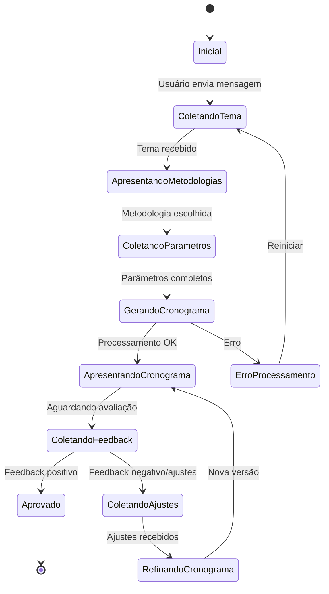

# 📚 Planejamento - Chatbot de Estudos Personalizados

## 📋 Visão Geral

Desenvolvimento de um chatbot inteligente que cria cronogramas de estudo personalizados baseados em metodologias de aprendizagem, utilizando o modelo Gemini 2.5 Flash.

---

## 🎯 Objetivo

Permitir que usuários criem roteiros de estudo personalizados através de uma conversa interativa, onde o chatbot:
1. Coleta o tema de estudo
2. Sugere e valida metodologias de aprendizagem
3. Gera cronogramas estruturados
4. Permite feedback e refinamento iterativo

---

## 🔄 Análise BDD - Refinamento dos Cenários

### **Feature 1: Criação de Roteiro de Estudo**

#### **Cenário 1: Início da Criação do Roteiro**
```gherkin
Funcionalidade: Iniciar criação de roteiro de estudo
  Como um usuário do chatbot
  Eu quero enviar um tema de estudo
  Para que o chatbot possa criar um cronograma personalizado

Cenário: Usuário inicia criação de roteiro
  Dado que o usuário está na interface do chatbot
  Quando o usuário envia um tema como "Python para Data Science"
  Então o chatbot deve:
    - Confirmar o recebimento do tema
    - Apresentar metodologias disponíveis:
      * Aprendizado Contínuo (Long-life Learning)
      * Shoshin (Mente de Principiante)
      * Kumon (Aprendizado Progressivo)
    - Permitir que o usuário solicite outras metodologias
    - Aguardar a escolha do usuário
```

**Pontos de Atenção:**
- ✅ Validar se o tema foi enviado
- ✅ Garantir que as metodologias sejam apresentadas de forma clara
- ✅ Permitir flexibilidade para metodologias customizadas
- ⚠️ **REFINAMENTO NECESSÁRIO**: Definir tempo de espera para resposta do usuário
- ⚠️ **REFINAMENTO NECESSÁRIO**: Como lidar com temas muito amplos ou vagos?

---

#### **Cenário 2: Seleção da Metodologia**
```gherkin
Funcionalidade: Escolher metodologia de estudo
  Como um usuário
  Eu quero escolher uma metodologia de aprendizagem
  Para que o cronograma seja adaptado ao meu estilo

Cenário: Usuário escolhe metodologia sugerida
  Dado que o chatbot apresentou as metodologias
  Quando o usuário escolhe "Kumon"
  Então o chatbot deve:
    - Confirmar a metodologia escolhida
    - Solicitar informações complementares:
      * Tempo disponível por dia/semana
      * Prazo desejado (dias/semanas/meses)
      * Nível de conhecimento atual (iniciante/intermediário/avançado)
    - Iniciar processamento do cronograma

Cenário: Usuário solicita metodologia personalizada
  Dado que o chatbot apresentou as metodologias
  Quando o usuário solicita "Pomodoro + Spaced Repetition"
  Então o chatbot deve:
    - Validar se compreendeu a metodologia
    - Solicitar detalhes sobre como aplicar
    - Confirmar antes de prosseguir
```

**Pontos de Atenção:**
- ✅ Capturar parâmetros essenciais (tempo, prazo, nível)
- ⚠️ **REFINAMENTO NECESSÁRIO**: Definir parâmetros padrão se usuário não informar
- ⚠️ **REFINAMENTO NECESSÁRIO**: Validação de metodologias customizadas pelo Gemini

---

#### **Cenário 3: Geração do Cronograma**
```gherkin
Funcionalidade: Gerar cronograma de estudos
  Como um chatbot
  Eu quero processar o tema e metodologia
  Para criar um cronograma estruturado e viável

Cenário: Cronograma gerado com sucesso
  Dado que tenho:
    - Tema: "Python para Data Science"
    - Metodologia: "Kumon"
    - Tempo: 2h/dia
    - Prazo: 3 meses
    - Nível: Iniciante
  Quando o processamento for concluído
  Então o cronograma deve conter:
    - Divisão em módulos/semanas
    - Tópicos por sessão de estudo
    - Exercícios práticos sugeridos
    - Marcos de avaliação
    - Recursos recomendados (links, livros, cursos)
    - Estimativa de progresso
  E deve ser apresentado de forma visual e organizada

Cenário: Erro na geração do cronograma
  Dado que ocorreu um erro no processamento
  Quando o chatbot não conseguir gerar o cronograma
  Então deve:
    - Informar o erro de forma amigável
    - Sugerir ajustes (tema mais específico, prazo realista)
    - Permitir nova tentativa
```

**Pontos de Atenção:**
- ✅ Estrutura clara e hierárquica do cronograma
- ✅ Recursos externos validados e atuais
- ⚠️ **REFINAMENTO NECESSÁRIO**: Formato de saída (Markdown, tabela, lista?)
- ⚠️ **REFINAMENTO NECESSÁRIO**: Como persistir o cronograma para edições futuras?

---

#### **Cenário 4: Feedback do Usuário**
```gherkin
Funcionalidade: Coletar feedback sobre o cronograma
  Como um usuário
  Eu quero avaliar o cronograma gerado
  Para validá-lo ou solicitar ajustes

Cenário: Usuário aprova o cronograma
  Dado que o cronograma foi apresentado
  Quando o usuário responde "Aprovado" ou emoji positivo (👍, ✅)
  Então o chatbot deve:
    - Confirmar a aprovação
    - Oferecer opções:
      * Exportar cronograma (PDF/Markdown)
      * Receber lembretes periódicos
      * Criar novo roteiro
      * Encerrar sessão

Cenário: Usuário rejeita o cronograma
  Dado que o cronograma foi apresentado
  Quando o usuário responde "Não gostei" ou emoji negativo (👎, ❌)
  Então o chatbot deve:
    - Perguntar especificamente o que não agradou:
      * Prazo muito longo/curto?
      * Conteúdo muito básico/avançado?
      * Falta de recursos práticos?
      * Outro motivo
    - Aguardar feedback detalhado

Cenário: Usuário solicita ajustes específicos
  Dado que o cronograma foi apresentado
  Quando o usuário solicita "Reduzir para 6 semanas e adicionar mais projetos práticos"
  Então o chatbot deve:
    - Confirmar os pontos de ajuste
    - Indicar que está reprocessando
    - Manter contexto do cronograma anterior
```

**Pontos de Atenção:**
- ✅ Reconhecer diferentes formas de feedback (texto, emojis)
- ⚠️ **REFINAMENTO NECESSÁRIO**: Limitar número de iterações de ajuste?
- ⚠️ **REFINAMENTO NECESSÁRIO**: Como lidar com feedbacks contraditórios?

---

#### **Cenário 5: Refinamento do Cronograma**
```gherkin
Funcionalidade: Refinar cronograma com base no feedback
  Como um chatbot inteligente
  Eu quero processar o feedback do usuário
  Para ajustar o cronograma de forma iterativa

Cenário: Ajuste bem-sucedido
  Dado que recebi feedback específico:
    - "Reduzir prazo de 12 para 8 semanas"
    - "Adicionar mais projetos práticos"
    - "Incluir ML básico no final"
  Quando processar os ajustes
  Então devo:
    - Manter estrutura base do cronograma anterior
    - Aplicar as alterações solicitadas
    - Destacar o que foi modificado
    - Apresentar nova versão
    - Perguntar se está adequado agora

Cenário: Ajuste conflitante
  Dado que recebi feedback contraditório:
    - "Mais rápido" + "Mais detalhado"
  Quando detectar conflito
  Então devo:
    - Alertar sobre a contradição
    - Sugerir compromisso (mais detalhado EM tópicos chave, mais rápido em básicos)
    - Pedir confirmação do usuário
```

**Pontos de Atenção:**
- ✅ Manter histórico de versões do cronograma
- ✅ Destacar diferenças entre versões
- ⚠️ **REFINAMENTO NECESSÁRIO**: Como armazenar versões anteriores?
- ⚠️ **REFINAMENTO NECESSÁRIO**: Permitir "voltar" para versão anterior?

---

## 🏗️ Arquitetura Proposta

### **Estrutura de Componentes**

```
chatbot_estudos/
├── streamlit_app.py           # Interface principal (já existe)
├── modules/
│   ├── __init__.py
│   ├── workflow_manager.py    # Gerenciador de fluxo de conversa
│   ├── cronograma_generator.py # Gerador de cronogramas
│   ├── feedback_processor.py   # Processador de feedback
│   └── prompt_templates.py     # Templates de prompts para Gemini
├── utils/
│   ├── __init__.py
│   ├── validators.py           # Validações de entrada
│   └── formatters.py           # Formatadores de saída
├── data/
│   ├── metodologias.json       # Dados sobre metodologias
│   └── recursos.json           # Recursos de aprendizagem
├── tests/
│   ├── test_workflow.py
│   ├── test_cronograma.py
│   └── test_feedback.py
├── .env                        # Variáveis de ambiente
├── requirements.txt
└── README.md
```

---

## 🔧 Stack Técnica

### **Core**
- **Python 3.11+**
- **Streamlit** - Interface do chatbot
- **Google Gemini 2.5 Flash** - LLM principal
- **python-dotenv** - Gerenciamento de variáveis

### **Adicionais Necessários**
- **Pydantic** - Validação de dados estruturados
- **JSON** - Armazenamento de estado da conversa
- **Markdown** - Formatação de cronogramas
- **(Opcional) SQLite** - Persistência de cronogramas salvos

---

## 📊 Fluxo de Estados da Conversa



---

## 🎨 Design da Interface

### **Layout Proposto**

```
┌─────────────────────────────────────────────┐
│  📚 Chatbot de Estudos Personalizados       │
├─────────────────────────────────────────────┤
│                                             │
│  [Histórico de Mensagens]                   │
│  ┌─────────────────────────────────────┐   │
│  │ 🤖 Olá! Qual tema você quer estudar?│   │
│  │ 👤 Python para Data Science          │   │
│  │ 🤖 Ótimo! Escolha uma metodologia... │   │
│  └─────────────────────────────────────┘   │
│                                             │
│  [Estado Atual]                             │
│  📍 Coletando metodologia                   │
│  ✅ Tema: Python para Data Science          │
│                                             │
│  ┌─────────────────────────────────────┐   │
│  │ Digite sua mensagem...              │   │
│  └─────────────────────────────────────┘   │
└─────────────────────────────────────────────┘
```

### **Componentes Visuais**
- ✅ **Indicador de estado** - Mostra etapa atual do processo
- ✅ **Resumo de contexto** - Exibe informações coletadas
- ✅ **Botões de ação rápida** - Para escolhas comuns
- ✅ **Progress bar** - Durante geração do cronograma
- ✅ **Formatação rica** - Cronogramas em Markdown/tabelas

---

## 📝 Prompts para o Gemini

### **Estrutura de Prompt System**

```python
SYSTEM_PROMPT = """
Você é um assistente especializado em criar cronogramas de estudo personalizados.

REGRAS:
1. Seja objetivo e didático
2. Pergunte apenas informações essenciais
3. Adapte cronogramas ao nível do usuário
4. Sugira recursos reais e atualizados
5. Seja encorajador e positivo

METODOLOGIAS CONHECIDAS:
- Long-life Learning: Aprendizado contínuo e sustentável
- Shoshin: Mente de principiante, sem pressupostos
- Kumon: Progressão gradual com repetição espaçada

FORMATO DE CRONOGRAMA:
- Use Markdown estruturado
- Divida em semanas/módulos
- Inclua objetivos claros
- Sugira exercícios práticos
- Adicione checkpoints de avaliação
"""
```

### **Templates de Prompts por Etapa**

#### **1. Confirmação de Tema**
```python
PROMPT_CONFIRMAR_TEMA = """
O usuário quer estudar: {tema}

Confirme o tema de forma amigável e pergunte qual metodologia prefere:
- Aprendizado Contínuo (Long-life Learning)
- Shoshin (Mente de Principiante)
- Kumon (Aprendizado Progressivo)

Permita que ele sugira outra metodologia.
"""
```

#### **2. Coleta de Parâmetros**
```python
PROMPT_COLETAR_PARAMETROS = """
Tema: {tema}
Metodologia: {metodologia}

Pergunte de forma natural:
1. Quanto tempo pode dedicar por dia/semana?
2. Qual o prazo desejado?
3. Qual seu nível atual? (iniciante/intermediário/avançado)

Seja conciso e use uma pergunta por vez se o usuário não fornecer tudo.
"""
```

#### **3. Geração de Cronograma**
```python
PROMPT_GERAR_CRONOGRAMA = """
Crie um cronograma de estudos detalhado:

TEMA: {tema}
METODOLOGIA: {metodologia}
TEMPO DISPONÍVEL: {tempo_disponivel}
PRAZO: {prazo}
NÍVEL: {nivel}

ESTRUTURA OBRIGATÓRIA:
## 📅 Cronograma de Estudos: {tema}

### 📊 Resumo
- **Duração:** {prazo}
- **Dedicação:** {tempo_disponivel}
- **Metodologia:** {metodologia}
- **Nível:** {nivel}

### 📚 Módulos

#### Semana 1: [Título]
**Objetivos:**
- [Objetivo 1]
- [Objetivo 2]

**Conteúdo:**
- [ ] Tópico 1
- [ ] Tópico 2

**Exercícios:**
- [Exercício prático]

**Recursos:**
- [Link/Livro recomendado]

[Repetir para cada semana/módulo]

### ✅ Marcos de Avaliação
- Semana X: [Checkpoint]

### 🎯 Próximos Passos
[Sugestões pós-cronograma]

IMPORTANTE:
- Seja realista com o prazo
- Progrida gradualmente
- Inclua prática desde o início
- Sugira recursos gratuitos quando possível
"""
```

#### **4. Processamento de Feedback**
```python
PROMPT_PROCESSAR_FEEDBACK = """
CRONOGRAMA ANTERIOR:
{cronograma_anterior}

FEEDBACK DO USUÁRIO:
{feedback}

TAREFA:
1. Identifique os pontos de insatisfação
2. Mantenha o que funcionou
3. Ajuste apenas o necessário
4. Destaque as mudanças com emoji 🔄

Gere o cronograma ajustado seguindo o mesmo formato.
"""
```

---

## 🧪 Casos de Teste BDD

### **Feature: Fluxo Completo**

```gherkin
Cenário: Criação completa de cronograma com aprovação
  Dado que inicio uma nova conversa
  Quando envio "Quero estudar JavaScript"
  Então vejo metodologias sugeridas
  
  Quando escolho "Kumon"
  Então vejo perguntas sobre tempo e prazo
  
  Quando respondo "2h/dia, 2 meses, sou iniciante"
  Então vejo um indicador de processamento
  E recebo um cronograma estruturado em até 30 segundos
  
  Quando respondo "Perfeito! 👍"
  Então vejo opções de exportação e próximos passos
```

```gherkin
Cenário: Refinamento iterativo
  Dado que tenho um cronograma gerado
  Quando solicito "Reduza para 6 semanas e mais projetos"
  Então vejo o cronograma ajustado
  E as mudanças estão destacadas
  
  Quando aprovo a segunda versão
  Então o processo é concluído
```

---

## ⚠️ Pontos Críticos Identificados

### **1. Gerenciamento de Estado**
**Problema:** Streamlit recarrega a cada interação
**Solução:** 
- Usar `st.session_state` para persistir:
  - Estado atual do fluxo
  - Dados coletados (tema, metodologia, parâmetros)
  - Versões do cronograma
  - Histórico de feedback

### **2. Validação de Entrada**
**Problema:** Usuários podem enviar dados inválidos
**Solução:**
- Validar tema (não vazio, tamanho razoável)
- Validar tempo (formato aceito: "2h/dia", "10h/semana")
- Validar prazo (realista: min 1 semana, max 1 ano)
- Usar Pydantic para estruturar dados

### **3. Timeout do Gemini**
**Problema:** Cronogramas complexos podem demorar
**Solução:**
- Mostrar indicador de progresso
- Timeout de 45 segundos
- Fallback para cronograma simplificado

### **4. Controle de Contexto**
**Problema:** Histórico muito longo excede limite do Gemini
**Solução:**
- Manter resumo do contexto essencial
- Limpar mensagens antigas mantendo dados-chave
- Usar compressão de histórico após 10 mensagens

### **5. Qualidade do Cronograma**
**Problema:** Cronogramas muito genéricos ou irrealistas
**Solução:**
- Prompts detalhados e estruturados
- Validação pós-geração (checar seções obrigatórias)
- Exemplos no prompt (few-shot learning)

---

## 📅 Roadmap de Desenvolvimento

### **Sprint 1: Fundação (Dias 1-3)**
- [ ] Refatorar estrutura do projeto
- [ ] Criar módulo `workflow_manager.py`
- [ ] Implementar máquina de estados
- [ ] Criar `prompt_templates.py`
- [ ] Testes unitários básicos

### **Sprint 2: Coleta de Dados (Dias 4-6)**
- [ ] Implementar fluxo de coleta de tema
- [ ] Implementar apresentação de metodologias
- [ ] Implementar coleta de parâmetros
- [ ] Validações de entrada
- [ ] Testes de integração

### **Sprint 3: Geração de Cronogramas (Dias 7-10)**
- [ ] Criar `cronograma_generator.py`
- [ ] Implementar prompts de geração
- [ ] Formatação de saída em Markdown
- [ ] Indicador de progresso
- [ ] Tratamento de erros

### **Sprint 4: Feedback e Refinamento (Dias 11-13)**
- [ ] Criar `feedback_processor.py`
- [ ] Implementar análise de feedback
- [ ] Implementar refinamento de cronograma
- [ ] Versionamento de cronogramas
- [ ] Testes end-to-end

### **Sprint 5: Melhorias e Polish (Dias 14-15)**
- [ ] Interface visual aprimorada
- [ ] Botões de ação rápida
- [ ] Exportação de cronogramas
- [ ] Documentação completa
- [ ] Deploy em produção

---

## 🚀 Próximos Passos Imediatos

1. **Criar estrutura de diretórios**
   ```bash
   mkdir -p modules utils data tests
   touch modules/__init__.py utils/__init__.py
   ```

2. **Instalar dependências adicionais**
   ```bash
   pip install pydantic pytest
   ```

3. **Criar arquivo de metodologias**
   - `data/metodologias.json` com descrições detalhadas

4. **Implementar WorkflowManager**
   - Classe para gerenciar estados da conversa
   - Métodos para transição entre estados

5. **Refatorar `streamlit_app.py`**
   - Separar lógica de UI da lógica de negócio
   - Integrar com WorkflowManager

---

## 📖 Documentação de Referência

### **Metodologias de Aprendizagem**

#### **Long-life Learning (Aprendizado Contínuo)**
- Foco: Sustentabilidade do aprendizado
- Características:
  - Sessões curtas e frequentes
  - Revisões espaçadas
  - Conexão com conhecimento prévio
  - Aplicação prática constante

#### **Shoshin (Mente de Principiante)**
- Foco: Abertura e curiosidade
- Características:
  - Sem pressupostos
  - Exploração ativa
  - Questionar tudo
  - Aprender fazendo

#### **Kumon (Progressão Gradual)**
- Foco: Domínio incremental
- Características:
  - Pequenos passos
  - Repetição com variação
  - Autocorreção
  - Avançar apenas com domínio completo

---

## 🎯 Métricas de Sucesso

### **Técnicas**
- ✅ 95% dos cronogramas gerados em < 30s
- ✅ Zero erros críticos em produção
- ✅ 90% de uptime

### **Experiência do Usuário**
- ✅ Máximo 5 perguntas até cronograma
- ✅ 80% de aprovação no primeiro cronograma
- ✅ Média de 2 iterações para refinamento

### **Qualidade do Conteúdo**
- ✅ 100% dos cronogramas com estrutura completa
- ✅ Prazos realistas (validação manual de amostra)
- ✅ Recursos externos válidos e atuais

---

## 📚 Referências

- [Streamlit Documentation](https://docs.streamlit.io/)
- [Google Gemini API Docs](https://ai.google.dev/docs)
- [BDD with Gherkin](https://cucumber.io/docs/gherkin/)
- [Learning Methodologies Research](https://scholar.google.com/)

---

## ✅ Checklist de Início

Antes de começar o desenvolvimento:

- [ ] Este documento foi revisado e aprovado
- [ ] Dúvidas e refinamentos foram esclarecidos
- [ ] Estrutura de pastas criada
- [ ] Dependências instaladas
- [ ] `.env` configurado
- [ ] Git configurado (branch, .gitignore)
- [ ] Primeiro teste manual do fluxo básico realizado

---

**Documento criado em:** 19/11/2025  
**Versão:** 1.0  
**Status:** 🟡 Aguardando aprovação para início do desenvolvimento
